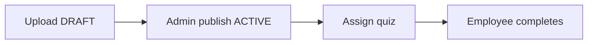

# Frontend implementation guide — Pharma LMS (Klonixpharback)

**Purpose:** Turn the backend API into a **shadcn/ui dashboard** product. Use this doc for **what to build**, **which APIs to call**, and **in what order**. For the **whole system** (all phases, modules, data model), see **[`SYSTEM_OVERVIEW.md`](./SYSTEM_OVERVIEW.md)**.

| Doc | Use for |
|-----|---------|
| [`SYSTEM_OVERVIEW.md`](./SYSTEM_OVERVIEW.md) | Full product: architecture, roles, all APIs, Phase 3 entities, end-to-end stories |
| [`FRONTEND_INTEGRATION.md`](./FRONTEND_INTEGRATION.md) | Auth, errors, HTTP conventions, detailed §6a shapes |
| [`API_ENDPOINTS.md`](./API_ENDPOINTS.md) | Complete route table |
| [`FRONTEND_AI_PROMPT.md`](./FRONTEND_AI_PROMPT.md) | Copy-paste AI system prompt |
| [`postman/E2E_FULL_FLOW.postman_collection.json`](../postman/E2E_FULL_FLOW.postman_collection.json) | Smoke-test request order |

**Stack:** React + Tailwind + **shadcn/ui** (sidebar shell, Card, Table, Form, Dialog, Badge, sonner toasts).

**Env:** `VITE_API_URL` or `NEXT_PUBLIC_API_URL` → API origin (no trailing slash).

---

## 1. App architecture

### 1.1 API client

```ts
// lib/api.ts (pattern)
const baseUrl = import.meta.env.VITE_API_URL ?? 'http://localhost:5000';

export async function api<T>(
  path: string,
  options: RequestInit & { token?: string } = {}
): Promise<T> {
  const { token, ...init } = options;
  const res = await fetch(`${baseUrl}${path}`, {
    ...init,
    headers: {
      ...(init.body instanceof FormData ? {} : { 'Content-Type': 'application/json' }),
      ...(token ? { Authorization: `Bearer ${token}` } : {}),
      ...init.headers,
    },
  });
  const data = await res.json().catch(() => ({}));
  if (!res.ok) {
    const err = new Error(data.message ?? res.statusText) as Error & {
      status: number;
      errorCode?: string;
      details?: unknown;
    };
    err.status = res.status;
    err.errorCode = data.errorCode;
    err.details = data.details;
    throw err;
  }
  return data as T;
}
```

- Branch UI on **`errorCode`**, not HTTP status alone.
- **`403` + `MUST_CHANGE_PASSWORD`** → redirect to `/change-password` (block all other routes).
- **`403` + `TENANT_REQUIRED`** → wrong token type (platform vs tenant).

### 1.2 Auth state (minimal)

| Field | Source |
|-------|--------|
| `token` | Login / change-password response |
| `role` | `PLATFORM_ADMIN` \| `SUPER_ADMIN` \| `ADMIN` \| `TRAINER` \| `EMPLOYEE` \| `AUDITOR` |
| `mustChangePassword` | Tenant login |
| `companyName`, `employeeId`, `name` | Tenant login (display) |

Persist `token` in memory + `sessionStorage` (or httpOnly cookie if you add a BFF later).

### 1.3 Route guard matrix

| Route prefix | Allowed roles |
|--------------|----------------|
| `/platform/*` | `PLATFORM_ADMIN` only |
| `/admin/*`, `/training/*` (manage) | `ADMIN`, `SUPER_ADMIN`, `TRAINER` (per screen) |
| `/compliance/*` | `ADMIN`, `TRAINER`, `AUDITOR` |
| `/learn/*` | All tenant roles; **EMPLOYEE**-heavy |
| `/auditor/*` | `AUDITOR` + read-only admin APIs |

`SUPER_ADMIN` → treat as **`ADMIN`** unless a screen is restricted (e.g. role changes).

---

## 2. Navigation map (suggested sidebar)

### Platform (`PLATFORM_ADMIN`)

| Nav label | Route | APIs |
|-----------|-------|------|
| Tenants / Onboard | `/platform/onboard` | `POST /api/platform/onboard` |
| Cross-tenant assignments | `/platform/assignments` | `GET /api/platform/assignments` |
| Platform KPIs | `/platform/stats` | `GET /api/platform/assignments/stats` |
| Per-company KPIs | `/platform/companies` | `GET /api/platform/companies/assignment-stats` |
| Platform audit | `/platform/audit` | `GET /api/audit/platform` |

### Tenant — Admin / Trainer

| Nav label | Route | APIs |
|-----------|-------|------|
| Dashboard | `/dashboard` | `GET /api/assignments/company/stats`, `GET /api/admin/stats` |
| SOP library | `/sops` | `GET/POST /api/sops/*` |
| Publish SOP | dialog on SOP row | `PATCH /api/sops/:id/status` |
| Courses | `/courses` | `/api/courses` |
| Course groups | `/course-groups` | `/api/course-groups` |
| Induction programs | `/induction` | `/api/induction-programs` |
| Assign training | `/assignments/new` | `POST /api/assignments`, `bulk-department` |
| Training plans | `/training-plans` | `/api/training-plans` |
| Job descriptions | `/job-descriptions` | `/api/job-descriptions` |
| Qualifications | `/qualifications` | `/api/qualifications` |
| Users & departments | `/admin/users` | `/api/admin/*` |
| Company branding | `/admin/company` | `GET/POST /api/admin/company` |
| Reports | `/reports/assignments` | §6a company list + export CSV |
| Audit log | `/audit` | `GET /api/audit/company` |

### Tenant — Employee

| Nav label | Route | APIs |
|-----------|-------|------|
| My training | `/learn/training` | `GET /api/assignments/my-training` |
| My induction | `/learn/induction` | `GET /api/induction-programs/my` |
| Take quiz | `/learn/quiz/:assignmentId` | submit, certificate |
| My qualifications | `/learn/qualifications` | `GET /api/qualifications/my` |

### Tenant — Auditor

| Nav label | Route | APIs |
|-----------|-------|------|
| Compliance overview | `/compliance` | analytics + `company/stats` |
| Verify audit / e-sign | `/compliance/verify` | `GET …/verify` |
| Export | button | `GET /api/export/training-report` |

---

## 3. Shared UI patterns

### 3.1 Compliance form fields

Many **write** APIs require audit text:

| Field | Rule | Used on |
|-------|------|---------|
| `reason` | min **5** or **10** chars (see API) | user create, assign, publish, enroll, etc. |
| `password` | current login password | publish SOP, unlock, ack, qualification decide |

**Reusable `<ComplianceReasonDialog>`:**

- Textarea `reason` (show min length in label).
- Password input for e-sign actions.
- Submit → call API → toast success / show `errorCode`.

### 3.2 E-sign dialog

Use for: SOP publish, assignment unlock, induction ack, qualification step decide.

```tsx
// Props: open, title, meaning, onConfirm({ reason, password })
// POST body matches API (reason + password where required)
```

On **`401` `INVALID_SIGNATURE`**, show inline error on password field.

### 3.3 Status badges

| Domain | Values | Badge variant hint |
|--------|--------|-------------------|
| SOP | `DRAFT`, `ACTIVE`, `ARCHIVED`, `UNDER_REVIEW` | DRAFT=secondary, ACTIVE=default, ARCHIVED=outline |
| Assignment | `PENDING`, `IN_PROGRESS`, `COMPLETED`, `OVERDUE`, `LOCKED_OUT` | OVERDUE/LOCKED_OUT=destructive |
| Plan | `DRAFT`, `ACTIVE`, `CLOSED` | same as SOP |
| Qualification | `PENDING_APPROVAL`, `APPROVED`, `REJECTED` | |

### 3.4 Tables

- Server-driven pagination: `page`, `limit` from API responses.
- Filters → query string → refetch.
- Nullable **`email`**: display `—`.
- **Snapshot columns** on assignments: prefer `assignedSopTitle`, `assignedSopVersion` over live `quiz.sop` in admin/audit views.

### 3.5 Signed URLs (SOP PDF, certificate)

- Use **`sopDisplayUrl`** / certificate `signedUrl` in iframe or `window.open`.
- TTL ~**600s** — refresh list or re-call `GET /api/sops/:id/file` before expiry if user keeps tab open.

---

## 4. Core flows (implement first)

### 4.1 Tenant login

**Screen:** `/login`

```http
POST /api/auth/login
{ "organization": "ACME", "employeeId": "ACME-1", "password": "..." }
```

→ Store `token`, `role`, `mustChangePassword`. If `mustChangePassword`, go to `/change-password`.

**Platform login:** `/platform/login` → `POST /api/platform/login` with `{ identifier, password }`.

### 4.2 Forced password change

**Screen:** `/change-password` (full page, no sidebar)

```http
POST /api/auth/change-password
Authorization: Bearer <token>
{ "currentPassword", "newPassword" }
```

→ Replace token from response; then enter app.

### 4.3 SOP upload → publish → assign (Phase 2 critical path)



| Step | API | UI notes |
|------|-----|----------|
| Upload | `POST /api/sops/upload` multipart | Show returned **`status: DRAFT`** badge |
| Publish | `PATCH /api/sops/:id/status` | **ADMIN/SUPER_ADMIN only**; e-sign dialog; TRAINER sees disabled + tooltip `SOP_ACTIVATION_FORBIDDEN` |
| Assign | `POST /api/assignments` | **409** `SOP_NOT_ASSIGNABLE` if not ACTIVE |
| List SOPs (employee) | `GET /api/sops` | Only ACTIVE rows |

### 4.4 Employee training loop

1. `GET /api/assignments/my-training`
2. Open assignment → load quiz from embed or `GET /api/quizzes/sop/:sopId`
3. Optional: `GET /api/sops/:id/study`, `POST /api/sops/:id/chat`
4. `POST /api/assignments/:id/submit` with answers + signature
5. On pass: `GET /api/assignments/:id/certificate`

### 4.5 Admin compliance dashboard

**Screen:** `/dashboard` or `/reports`

| Widget | API |
|--------|-----|
| KPI cards | `GET /api/assignments/company/stats` |
| Overdue table | `GET /api/assignments/company?overdueOnly=true` |
| Lockouts | `?status=LOCKED_OUT` |
| Trainee drill-down | `GET /api/assignments/company/users/:userId` |
| CSV export | `GET /api/export/training-report` (download blob) |

### 4.6 Audit / verify (Phase 1 exit)

**Screen:** `/audit` + row action “Verify”

- `GET /api/audit/company?page&limit`
- `GET /api/audit/:id/verify` → show `valid` / message (see `INTEGRITY_VERIFY_SIMULATION.md` for QA)

Same pattern for `GET /api/esignatures/:id/verify`.

---

## 5. Phase 3 modules

### 5.1 Platform oversight

**`/platform/assignments`** — DataTable

```http
GET /api/platform/assignments?page=1&limit=25&companyId=&status=&search=
```

- Columns: company name, trainee, SOP title, status, deadline.
- **No** PDF links (API omits signed URLs by design).

**`/platform/stats`** — KPI cards

```http
GET /api/platform/assignments/stats?companyId=<optional>
```

**`/platform/companies`** — Table of tenants + stats

```http
GET /api/platform/companies/assignment-stats?page=1&limit=25&companyStatus=ACTIVE
```

### 5.2 Course catalog

**`/courses`**

| Action | API |
|--------|-----|
| List | `GET /api/courses?status=&search=` |
| Create | `POST /api/courses` `{ name, sopId, description?, reason }` |
| Edit | `PATCH /api/courses/:id` |

Link each course to an **SOP** (published ACTIVE recommended for assign flows).

### 5.3 Course groups

**`/course-groups/:id`**

1. Create group — `POST /api/course-groups`
2. Add courses — `POST /api/course-groups/:id/courses` `{ courseId, sortOrder?, reason }`
3. Assign department — `POST …/assign-department` `{ departmentId, deadline?, reason }`

Show response: **`created`**, **`skippedSops`**, **`quizzesAssigned`**.

### 5.4 Induction programs

**Admin `/induction/:programId`**

1. `POST /api/induction-programs` — create program
2. `POST …/steps` — discriminated body:
   - **COURSE:** `{ stepType: "COURSE", title, courseId, reason }`
   - **ACK:** `{ stepType: "ACKNOWLEDGMENT", title, ackText, reason }`
3. Enroll — `POST …/enroll-user` or `…/enroll-department`

**Learner `/learn/induction`**

- `GET /api/induction-programs/my` — stepper UI
- **COURSE step:** link to assignment (from `progress[].assignment` if you expose it) or my-training; poll `GET /my` after quiz pass (backend syncs completion)
- **ACK step:** `POST /api/induction-enrollments/:enrollmentId/steps/:stepId/acknowledge` with e-sign dialog

### 5.5 Yearly training planner

**`/training-plans/:planId`**

| Action | API |
|--------|-----|
| Create plan | `POST /api/training-plans` `{ calendarYear, title, reason }` |
| Activate | `PATCH …` `status: "ACTIVE"` |
| Add line | `POST …/items` `{ label, courseId?, sopId?, departmentId?, plannedMonth?, notes? }` |
| Monthly review | `POST …/reviews` `{ reviewType: "MONTHLY", periodKey: "2026-03", commentary, reason }` |
| Annual review | `reviewType: "ANNUAL", periodKey: "2026"` |

**UI ideas:**

- Calendar or 12-column grid by `plannedMonth`
- Reviews timeline on plan detail (list `reviews` from `GET /:id`)
- **AUDITOR** can add reviews; read-only on items unless TRAINER/ADMIN

*Not yet in API:* auto-assign from plan lines — assign manually via assignments/course-groups for now.

### 5.6 Job description (JD) matrix

**`/job-descriptions/:id`**

1. `POST /api/job-descriptions` — `{ code, title, description?, reason }`
2. Matrix table: required courses — `POST …/courses` `{ courseId, reason }`
3. Assigned people — `POST …/assign-user` `{ userId, reason }`
4. Detail — `GET /api/job-descriptions/:id` (courses + `userLinks`)

*Future UI:* gap report (required courses vs user completions) — not in API yet.

### 5.7 Qualification ladders (HOD → Head QA)

**`/qualifications`**

| Action | API | Who |
|--------|-----|-----|
| Create request | `POST /api/qualifications` | ADMIN, TRAINER |
| List | `GET /api/qualifications?status=` | ADMIN, TRAINER, AUDITOR |
| My status | `GET /api/qualifications/my` | Subject user |
| Decide step | `POST /api/qualifications/:id/steps/:stepId/decide` | See below |

**Approval UI:**

- Show steps 1 **HOD** → 2 **HEAD QA** as vertical stepper
- Only **current PENDING** step shows Approve/Reject
- **HOD** deciders: `ADMIN`, `TRAINER`, `SUPER_ADMIN`
- **Head QA** deciders: `ADMIN`, `SUPER_ADMIN` only
- Body: `{ decision: "APPROVE"|"REJECT", reason, password }`

**Errors:** `QUALIFICATION_STEP_OUT_OF_ORDER`, `QUALIFICATION_APPROVER_FORBIDDEN`, `QUALIFICATION_ALREADY_PENDING`

---

## 6. Error codes — frontend branch reference

| `errorCode` | HTTP | UI action |
|-------------|------|-----------|
| `MUST_CHANGE_PASSWORD` | 403 | Redirect change-password |
| `TENANT_REQUIRED` | 403 | Wrong portal / token type |
| `VALIDATION_ERROR` | 400 | Map `details.issues` to form fields |
| `AUTH_INVALID_CREDENTIALS` | 401 | Login error |
| `INVALID_SIGNATURE` | 401 | E-sign password wrong |
| `SOP_NOT_ASSIGNABLE` | 409 | Toast + link to publish SOP |
| `SOP_ACTIVATION_FORBIDDEN` | 403 | Hide publish for TRAINER |
| `SOP_NOT_ACCESSIBLE` | 403 | Employee blocked from draft SOP |
| `ASSIGNMENT_ALREADY_EXISTS` | 409 | Inform admin |
| `SOP_DUPLICATE_TITLE_VERSION` | 409 | Upload form error |
| `COURSE_DUPLICATE_NAME` | 409 | |
| `COURSE_GROUP_EMPTY` | 409 | Add courses first |
| `INDUCTION_ALREADY_ENROLLED` | 409 | |
| `TRAINING_PLAN_REVIEW_DUPLICATE` | 409 | Period already reviewed |
| `JD_DUPLICATE_CODE` | 409 | |
| `QUALIFICATION_STEP_OUT_OF_ORDER` | 409 | |
| `QUALIFICATION_APPROVER_FORBIDDEN` | 403 | Show role hint |

---

## 7. Suggested implementation order

| Sprint | Deliverable | Validates |
|--------|-------------|-----------|
| **A** | API client, auth, guards, change-password | Login E2E |
| **B** | SOP list/upload/publish, employee my-training + quiz submit | Phase 2 SoD |
| **C** | Admin dashboard §6a, audit list + verify buttons | Phase 1 compliance |
| **D** | Platform pages (assignments, stats) | Phase 3 SaaS ops |
| **E** | Courses + course groups + assign department | Catalog |
| **F** | Induction admin + learner stepper | Onboarding |
| **G** | Training plans + reviews | Planner |
| **H** | JD matrix + qualifications stepper | Enterprise |

Run Postman folders **0→6** after each sprint that touches core training.

---

## 8. TypeScript types (starter)

Define in `types/api.ts` from real responses (Network tab / Postman):

```ts
export type ApiError = { message: string; errorCode: string; details?: unknown };

export type AssignmentStatus =
  | 'PENDING' | 'IN_PROGRESS' | 'COMPLETED' | 'OVERDUE' | 'LOCKED_OUT';

export type Paginated<T> = { page: number; limit: number; total: number; data: T[] };

// Extend per module: Course, CourseGroup, InductionEnrollment, TrainingPlan, JobDescription, QualificationRequest
```

---

## 9. Testing checklist

- [ ] Tenant login with **prefix** and with **licenseId** as `organization`
- [ ] `mustChangePassword` gate blocks API until change-password
- [ ] Upload SOP → **DRAFT** badge → admin publish → assign succeeds
- [ ] TRAINER cannot publish (403)
- [ ] Employee cannot open DRAFT SOP file
- [ ] Platform token on `/assignments/company` → `TENANT_REQUIRED`
- [ ] Course group assign shows `created` / `skippedSops`
- [ ] Induction ACK requires password
- [ ] Qualification: cannot approve step 2 before step 1
- [ ] Audit verify button shows result

---

## 10. Related docs

| File | Content |
|------|---------|
| [`FRONTEND_INTEGRATION.md`](./FRONTEND_INTEGRATION.md) | Deep integration reference |
| [`API_ENDPOINTS.md`](./API_ENDPOINTS.md) | All routes |
| [`MVP_PRODUCT_SCOPE.md`](./MVP_PRODUCT_SCOPE.md) | Phased scope |
| [`INTEGRITY_VERIFY_SIMULATION.md`](./INTEGRITY_VERIFY_SIMULATION.md) | Verify QA |

When implementing a screen, open **this guide** for layout + flow, **`API_ENDPOINTS.md`** for exact paths, and **Postman** for sample payloads.
