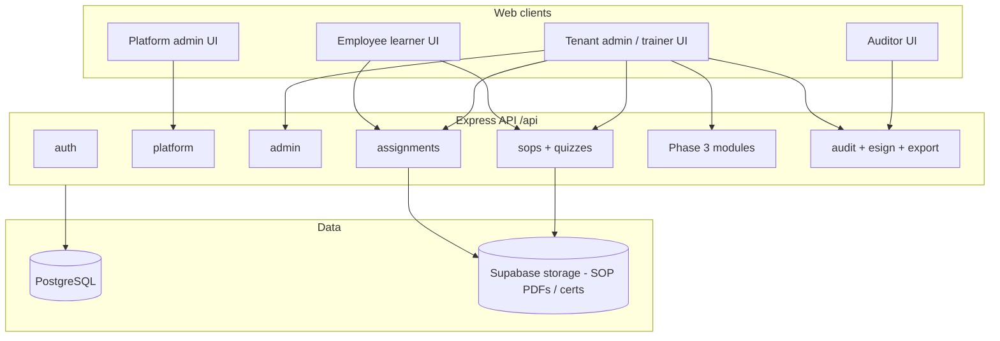
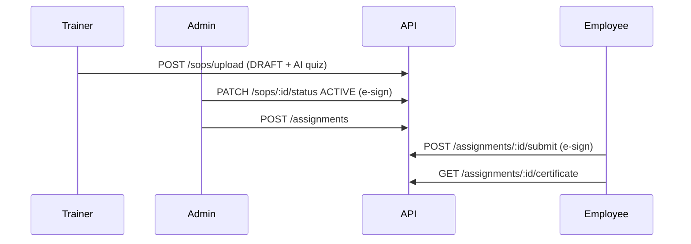

# System overview — Pharma Training LMS (Klonixpharback)

**One-page intent:** Multi-tenant SaaS for **controlled SOP-based training**, **quizzes**, **completion records**, **audit/e-sign**, and **compliance reporting**—with Phase 3 extensions for **catalogs**, **induction**, **yearly planning**, **JD matrices**, and **qualification approval ladders**.

**Audience:** product, QA, frontend, backend, and customer-facing demos.

---

## 1. Architecture



| Layer | Technology |
|-------|------------|
| API | Node.js, Express, TypeScript |
| ORM | Prisma 7 |
| Auth | JWT (`Authorization: Bearer`) |
| Files | Supabase (SOP PDFs, certificates, logos) |
| AI | Quiz generation, SOP study/chat (on upload / on demand) |

---

## 2. Tenancy and roles

### 2.1 Two levels

| Level | Who | `companyId` on JWT |
|-------|-----|-------------------|
| **Platform** | SaaS operator (`PLATFORM_ADMIN`) | No — use `/api/platform/*` only |
| **Tenant** | One pharma company | Yes — all other `/api/*` tenant routes |

### 2.2 Tenant roles

| Role | Typical use |
|------|-------------|
| **SUPER_ADMIN** | First user from onboard; acts as **ADMIN** in most routes |
| **ADMIN** | Users, publish SOPs, assign, planner, JD, qualifications (Head QA step) |
| **TRAINER** | Upload SOP (DRAFT), assign, courses; **cannot** publish to ACTIVE |
| **AUDITOR** | Read reports, audit, plan reviews; no writes except reviews |
| **EMPLOYEE** | My training, induction, quizzes; sees only **ACTIVE** content |

### 2.3 Login

| User | Endpoint | Identity |
|------|----------|----------|
| Tenant | `POST /api/auth/login` | `organization` (prefix or licenseId) + `employeeId` + `password` |
| Platform | `POST /api/platform/login` | Email + `password` |

---

## 3. API map (all route prefixes)

| Prefix | Purpose |
|--------|---------|
| `/api/auth` | Login, set-password (invite), change-password |
| `/api/platform` | Onboard tenant, platform login, **cross-tenant** assignment oversight |
| `/api/admin` | Company profile, logo, departments, users, stats |
| `/api/sops` | SOP CRUD, upload, publish, study, chat, revise |
| `/api/quizzes` | Manual quiz, list by SOP |
| `/api/assignments` | Assign, my training, submit, certificate, **company reports**, unlock |
| `/api/analytics` | Compliance / risk / difficulty |
| `/api/export` | Training CSV |
| `/api/notifications` | In-app notifications |
| `/api/audit` | Company + platform audit feeds, **verify** integrity |
| `/api/esignatures` | E-sign ledger, **verify** |
| `/api/courses` | **Phase 3** — course catalog (links to SOP) |
| `/api/course-groups` | **Phase 3** — bundles + assign department |
| `/api/induction-programs` | **Phase 3** — multi-step programs |
| `/api/induction-enrollments` | **Phase 3** — learner ack steps |
| `/api/training-plans` | **Phase 3** — yearly planner + reviews |
| `/api/job-descriptions` | **Phase 3** — JD matrix |
| `/api/qualifications` | **Phase 3** — HOD → Head QA ladders |

**Full table:** [`API_ENDPOINTS.md`](./API_ENDPOINTS.md)

---

## 4. Core domain (Phase 0–2)

### 4.1 Document → training record



| Concept | Rule |
|---------|------|
| **SOP status** | `DRAFT` → `ACTIVE` (publish) → `ARCHIVED` / `UNDER_REVIEW` |
| **Assign gate** | Only **ACTIVE** SOPs (**409** `SOP_NOT_ASSIGNABLE`) |
| **SoD** | Upload = TRAINER/ADMIN; **ACTIVE** = ADMIN/SUPER_ADMIN only |
| **Snapshot** | Each assignment stores `assignedSopTitle`, `assignedSopVersion`, … at assign time |
| **Learner view** | Employees only see **ACTIVE** SOPs / courses |

### 4.2 Compliance

- **Audit log** — chained hashes on company + platform events  
- **E-signatures** — password re-auth on sensitive actions  
- **Verify** — `GET /api/audit/:id/verify`, `GET /api/esignatures/:id/verify`  
- **Export** — CSV training report (prefers snapshot columns)

### 4.3 Reporting (tenant)

| Screen need | API |
|-------------|-----|
| KPI cards | `GET /api/assignments/company/stats` |
| Assignment grid | `GET /api/assignments/company` |
| Trainee dossier | `GET /api/assignments/company/users/:userId` |

Platform token → **403** `TENANT_REQUIRED` on these; use `/api/platform/assignments` instead.

---

## 5. Phase 3 modules (new system capabilities)

### 5.1 Platform oversight (SaaS operator)

| API | What it does |
|-----|----------------|
| `GET /api/platform/assignments` | Cross-tenant assignment list (filters, pagination) |
| `GET /api/platform/assignments/stats` | Global or per-company KPIs |
| `GET /api/platform/companies/assignment-stats` | Per-tenant KPI table |

No signed SOP URLs on platform list (support view only).

### 5.2 Course catalog & groups

| Entity | Description |
|--------|-------------|
| **Course** | Named training offering linked to one **SOP** |
| **CourseGroup** | Named set of courses |

| Action | API |
|--------|-----|
| Manage courses | `/api/courses` |
| Build group, add courses | `/api/course-groups`, `POST …/courses` |
| Assign all courses in group to a department | `POST …/assign-department` (first quiz per SOP, ACTIVE only, dedupe) |

### 5.3 Induction programs

| Entity | Description |
|--------|-------------|
| **InductionProgram** | Onboarding checklist for new hires |
| **InductionStep** | `COURSE` (quiz via course) or `ACKNOWLEDGMENT` (e-sign text) |
| **InductionEnrollment** | User progress through program |

| Actor | API |
|-------|-----|
| Admin | Create program, add steps, enroll user/department |
| Learner | `GET /api/induction-programs/my`, ack via `/api/induction-enrollments/.../acknowledge` |

Course steps complete when linked assignment is **passed**; program completes when all steps done.

### 5.4 Yearly training planner

| Entity | Description |
|--------|-------------|
| **TrainingPlan** | e.g. “2026 GMP training plan” (`DRAFT` / `ACTIVE` / `CLOSED`) |
| **TrainingPlanItem** | Planned line (label, optional course/SOP/department, month 1–12) |
| **TrainingPlanReview** | Monthly or annual **commentary** (`periodKey` + text) |

API: `/api/training-plans` (+ items, reviews).

*Not automated yet:* bulk assign from plan lines.

### 5.5 Job description (JD) matrix

| Entity | Description |
|--------|-------------|
| **JobDescription** | Role code + title (e.g. `OP-001` Operator) |
| **JobDescriptionCourse** | Required courses for that JD |
| **UserJobDescription** | User assigned to a JD |

API: `/api/job-descriptions` (+ link courses, assign users).

*Not automated yet:* gap analysis (required vs completed).

### 5.6 Qualification ladders (HOD → Head QA)

| Entity | Description |
|--------|-------------|
| **QualificationRequest** | Employee or trainer qualification workflow |
| **QualificationApprovalStep** | Step 1 **HOD**, Step 2 **HEAD_QA** (sequential, e-sign) |

| Step | Who may approve |
|------|-----------------|
| HOD | ADMIN, TRAINER, SUPER_ADMIN |
| Head QA | ADMIN, SUPER_ADMIN |

API: `/api/qualifications` (+ `POST …/steps/:stepId/decide`).

---

## 6. Data model (Prisma) — new tables summary

| Migration folder | Adds |
|------------------|------|
| `20260512100000_phase1_assignment_training_snapshot` | Snapshot columns on `Assignment` |
| `20260515120000_phase3_course_catalog` | `Course`, `CourseGroup`, `CourseGroupCourse` |
| `20260515140000_phase3_induction_programs` | Induction * |
| `20260515160000_phase3_planner_jd_qualification` | `TrainingPlan*`, `JobDescription*`, `Qualification*` |

**Apply:** `npx prisma db push` (dev) or `npx prisma migrate deploy` (prod).

---

## 7. End-to-end stories (how modules connect)

### Story A — Standard GMP training (Phase 0–2)

1. Platform **onboards** tenant → super admin **set-password** → **login**  
2. Admin creates **departments** and **users**  
3. Trainer **uploads SOP** (DRAFT) → Admin **publishes** ACTIVE  
4. Admin **assigns** quiz → Employee **completes** → **certificate**  
5. Auditor exports **CSV** and **verifies** audit chain  

### Story B — Department onboarding package (Phase 3)

1. Create **courses** from published SOPs  
2. Create **course group** “New hire Q1” → add courses → **assign department**  
3. Create **induction program** with same courses + policy **ACK** steps → **enroll department**  
4. Employees see **My training** + **My induction**  

### Story C — Annual planning & QA (Phase 3)

1. Create **training plan** for calendar year → add **items** by month  
2. **AUDITOR** adds **monthly review** commentary  
3. Define **job descriptions** with required **courses** → assign users to JDs  
4. Open **qualification request** for trainer → **HOD** approves → **Head QA** approves  

### Story D — SaaS support (Phase 3)

1. Platform admin views **per-company stats** and drills into **assignment list** for a tenant  

---

## 8. Standard API conventions

| Topic | Convention |
|-------|------------|
| Auth header | `Authorization: Bearer <jwt>` |
| Errors | `{ message, errorCode, details? }` — branch UI on **errorCode** |
| Compliance writes | Most mutations need `reason` (5–10+ chars); e-sign actions need `password` |
| Pagination | `{ page, limit, total, data }` where supported |
| Idempotency | Assign paths dedupe user+quiz; bulk returns `created` / `skipped` |

---

## 9. Documentation index

| Document | Use when you need… |
|----------|-------------------|
| **[`SYSTEM_OVERVIEW.md`](./SYSTEM_OVERVIEW.md)** | **This file** — whole product picture |
| [`FRONTEND_IMPLEMENTATION_GUIDE.md`](./FRONTEND_IMPLEMENTATION_GUIDE.md) | Screens, nav, UI build order |
| [`FRONTEND_INTEGRATION.md`](./FRONTEND_INTEGRATION.md) | Auth, errors, §6a payloads |
| [`API_ENDPOINTS.md`](./API_ENDPOINTS.md) | Every route |
| [`MVP_PRODUCT_SCOPE.md`](./MVP_PRODUCT_SCOPE.md) | Phased roadmap & status |
| [`COMPLIANCE_EVIDENCE_PACK_OUTLINE.md`](./COMPLIANCE_EVIDENCE_PACK_OUTLINE.md) | Customer evidence / RTM starter |
| [`SECURITY_DEPLOYMENT_CHECKLIST.md`](./SECURITY_DEPLOYMENT_CHECKLIST.md) | Deploy & secrets |
| [`INTEGRITY_VERIFY_SIMULATION.md`](./INTEGRITY_VERIFY_SIMULATION.md) | QA verify demos |
| [`postman/E2E_POSTMAN_README.md`](../postman/E2E_POSTMAN_README.md) | Postman smoke tests |

---

## 10. Built vs not built

### In scope today (backend)

- Full **Phase 0** demo path  
- **Phase 1–2** compliance gates and SoD  
- **Phase 3** slices 1–8 (platform oversight, catalog, induction, planner, JD, qualifications)  

### Still out of scope (roadmap)

- Classroom / external training / attendance  
- User groups (beyond department assign)  
- Training Manager dedicated role  
- Planner auto-assign from plan lines  
- JD completion gap reports  
- Classroom, fingerprint, knowledge library, division/site admin  
- Most **PLATFORM_ADMIN** write APIs beyond onboard  

### Frontend

- **APIs exist** for all modules above; UI is guided by [`FRONTEND_IMPLEMENTATION_GUIDE.md`](./FRONTEND_IMPLEMENTATION_GUIDE.md) (not all screens shipped in repo).

---

## 11. Quick reference — Phase 3 API only

```
GET  /api/platform/assignments
GET  /api/platform/assignments/stats
GET  /api/platform/companies/assignment-stats

GET|POST|PATCH  /api/courses
GET|POST|PATCH  /api/course-groups
POST            /api/course-groups/:id/courses
DELETE          /api/course-groups/:id/courses/:courseId
POST            /api/course-groups/:id/assign-department

GET|POST|PATCH  /api/induction-programs
GET             /api/induction-programs/my
POST            /api/induction-programs/:id/steps
POST            /api/induction-programs/:id/enroll-user
POST            /api/induction-programs/:id/enroll-department
POST            /api/induction-enrollments/:eid/steps/:sid/acknowledge

GET|POST|PATCH  /api/training-plans
POST            /api/training-plans/:id/items
POST            /api/training-plans/:id/reviews

GET|POST|PATCH  /api/job-descriptions
POST            /api/job-descriptions/:id/courses
POST            /api/job-descriptions/:id/assign-user

GET|POST        /api/qualifications
GET             /api/qualifications/my
POST            /api/qualifications/:id/steps/:stepId/decide
```

---

*Last aligned with backend routes in `src/app.ts` and scope in `docs/MVP_PRODUCT_SCOPE.md`.*
